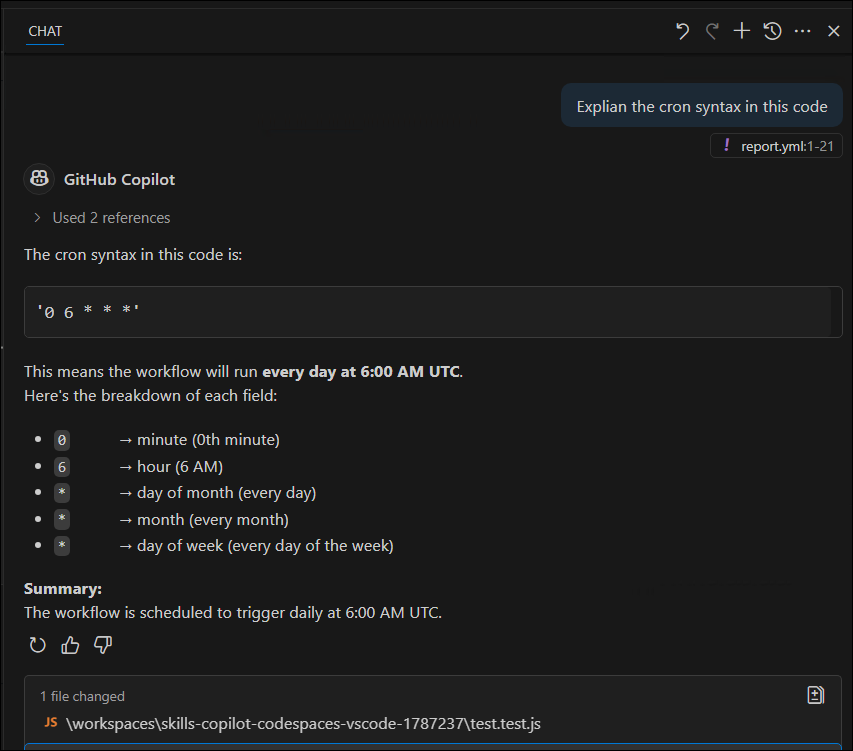

# Exercise 8: Using GitHub Copilot for T-SQL and YAML Code [Optional]

### Estimated Duration: 15 minutes

In this exercise, the primary objective is to leverage the capabilities of GitHub Copilot, a powerful AI-assisted coding tool, to assist you in generating code for two distinct programming languages: T-SQL and YAML. You can leverage comments to generate Copilot suggestions!

>**Disclaimer**: GitHub Copilot will automatically suggest an entire function body or code in gray text. Examples of what you'll most likely see in this exercise, but the exact suggestion may vary.

>**Note**: If you are unable to see any suggestions by GitHub Copilot in VS Code, please restart the VS Code once and try again. 

## Lab objectives

You will be able to complete the following tasks:

- Task 1: Generate a SQL query with GitHub Copilot using comments
- Task 2: Generate YAML with GitHub Copilot using comments

### Task 1: Generate a SQL query with GitHub Copilot using comments

1. Navigate back to the **codespace window** in the Visual Studio Code and from inside the codespace in the VS Code Explorer window, create a **new file**.

    >**Note:** Previous exercise you have done in a new window, so switch back to the codespace window.

     

1. Name the file `demo.sql`, type the below comment and press **Enter**.

   ```
   -- create a table with 5 coloumns customer_id, customer_fname, customer_lname, customer_phone, customer_address
   ```

       
   
1. Notice how the Copilot can generate the next lines of code.

1. Click on `Tab` and press **Enter**.

1. Follow up with the rows. Type the below comment and press **Enter**.

   ```
   -- fill in 5 rows in customers table
   ```

       

1. Click on `Tab` and press **Enter**.

1. Let's execute the query to show the table. Type the below comment and press **Enter**

   ```
   -- show the data in customers table
   ```

       

1. Click on Enter and click on `Tab` to select the suggestion.

1. Press `Ctrl+S` to save the file.

1. Click on the Windows Start icon and, search **SSMS (1)** and then select **SQL Server Management Studio 21 (2)**.

   

1. On the sign-in page, select **Skip and add accounts later**.

   

2. In the **New connection dialog experience** popup, click **Yes**.

    

    - Wait for a moment until the page loads.

3. Ensure the following details are added:

   - **Server name:** **labvm-<inject key="Deployment-id" enableCopy="false"/>\\SQLEXPRESS (1)**
   - **Authentication:** **Windows Authentication (2)**
   - **Encryption:** Check the box for **Trust server certificate (3)**
   - Click **Connect (4)**

   
     
1. Once you are connected to the server, click on **New Query** on the top.

   

1. Navigate to the **Visual Studio Code** and copy all the content we have fetched in `demo.sql`.

1. Paste it in the new query page.

1. Select each **block of code (1)** and click on **Execute (2)**. Notice how each block of code executes successfully, producing the expected output in the terminal.

   

   

   
   
1. You can observe how it processes each block of code and displays the Customers table.

      
   
### Task 2: Generate YAML with GitHub Copilot using comments
   
1. From inside the codespace in the VS Code Explorer window, create a new file and name the file as `report.yml`

    

1. Press `Ctrl + I`, type the below comment, and hit send:

   ```
   # Create a GitHub action to email a report from a file at 6 a.m. daily
   ```
   

1. Click on **Accept**.

   

      > **Note**: You may not see the same suggestions as shown in the screenshot; exact suggestions may vary.

1. Open GitHub Copilot Chat from the top and type `Explian the cron syntax in this code` and hit **send**.

      
   
1. Review the response and understand the uses of cron syntax.

      

1. Offer another query: `How should a GitHub Actions YAML file be structured?` and evaluate the provided response.

   
   
### Summary

In this exercise, you have successfully generated code for SQL and YAML using comments with the help of GitHub Copilot.

## You have successfully completed the lab. Click on **Next >>** to proceed with the next exercise.
